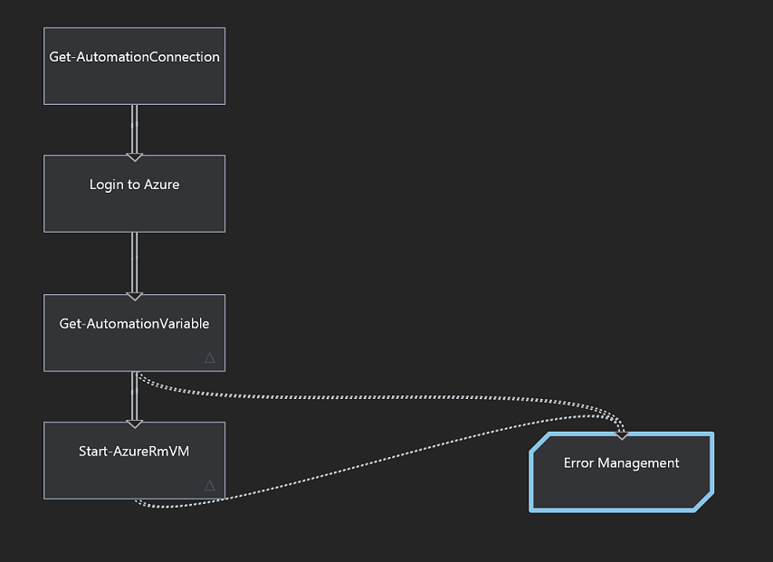

# Error handling in Azure Automation graphical runbooks

A key runbook design principal you need to consider, is to identify different issues that a runbook may experience such as success, expected error states, and unexpected error conditions.  Runbooks should include error handling to detect accordingly.  With graphical runbooks, if you wanted to validate the output of an activity or handle an error in an appropriate manner, you would possibly follow with a PowerShell code activity, define conditional logic on the output link of the activity, or other apply another method.          

Oftentimes when your runbooks execute, if there is a non-terminating error that occurs with an activity, any activity following it will be processed regardless.  Of course, it will likely generate an exception, but the point is the next activity is allowed to execute. The reason behind this behavior is because of how the PowerShell language is designed to handle errors.    

The types of PowerShell errors that can occur during execution are terminating or non-terminating.  The difference are the following:

* Terminating error: A serious error during execution that halts the command (or script execution) completely. Examples can include non-existent cmdlets, syntax errors that would prevent a cmdlet from running, or other fatal errors.

* Non-Terminating error: A non-serious error that allows execution to continue despite the failure. Examples include operational errors such file not found, permissions problems, etc.

Azure Automation graphical runbooks have been improved with the ability to include error handling so that you can now turn exceptions into non-terminating errors and create error links between activities. This allows a runbook author to catch errors and have a path to manage the realized or unexpected condition.  

## When to use

Controlling workflow execution is important to ensure whenever there is a critical activity that throws an error or exception, you can prevent proceeding to the next activity in your runbook and handle the error appropriately.  This is especially necessary when your runbooks are supporting a business or service operations process.

For each activity that could produce an error, the runbook author can add an error link pointing to any other activity.  The destination activity can be of any type: Code activity, invoking a cmdlet, invoking another runbook, or anything else. 

Furthermore, the destination activity can also have outgoing links, and they can be regular or error links, so the runbook author can implement complex error handling logic without resorting to including a code activity.  While the recommended practice is to create a dedicated error handling runbook with common functionality, it is not mandatory and error handling logic in a PowerShell code activity it isn't the only alternative.  

As an example, consider a runbook that tries to start a VM and install an application on it, but if the VM does not start correctly, it performs two actions: 

1. Send a notification about this problem.
2. Start another runbook that automatically provisions a new VM instead. 

One solution would be to have an error link pointing to an activity to handle step 1, like the **Write-Warning** cmdlet, connected to an activity for step 2, like **Start-AzureRmAutomationRunbook** cmdlet. 

You could also generalize this behavior for use in many runbooks and put these two activities in a separate error handling runbook, following the guidance suggested earlier.  Before calling this error-handling runbook you could construct a custom message from the data in the original runbook, and then pass this as a parameter to the error-handling runbook. 

## How to use

Each activity has a configuration to turn exceptions to non-terminating errors. By default, this is disabled.  You should enable this on any activity where you want to handle errors.  By enabling his configuration you are assuring that both terminating and non-terminating errors in the activity will be handled as non-terminating errors, and then can be handled with an error link.  After configuring this setting, you create an activities that will handle the error.  If an activity produces any error, then the outgoing error links will be followed, and the regular links will not, even if an the activity produced regular output as well.   

In the following simple example, we have a runbook that retrieves a variable that contains the computer name of a virtual machine and then attempts to start the virtual machine with the next activity.           

The **Get-AutomationVariable** activity and **Start-AzureRmVm** are configured to convert exceptions to errors.  If there are problems getting the variable or starting the VM, then errors will be generated.   

Error links flow from these activities to a single **Error Management** activity (a Code activity), which is configured with a simple PowerShell expression using the *Throw* keyword to stop processing along with *$Error.Exception.Message* to get the message that describes the current exception.   

## Next steps

* To learn more about links and understand link types in graphical runbooks, see [Graphical Authoring in Azure Automation](automation-graphical-authoring-intro.md#links-and-workflow).

* To learn more about runbook execution, how to monitor runbook jobs, and other technical details, see [Track a runbook job](automation-runbook-execution.md) 